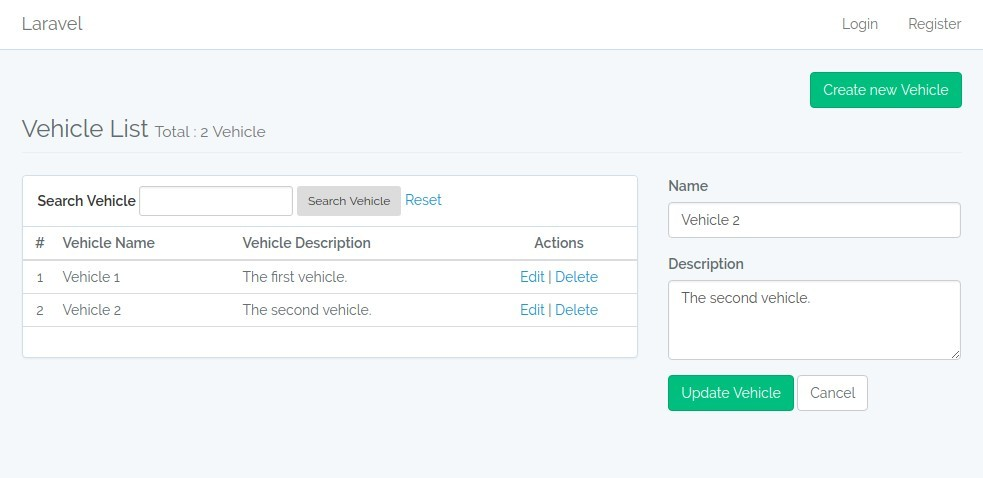
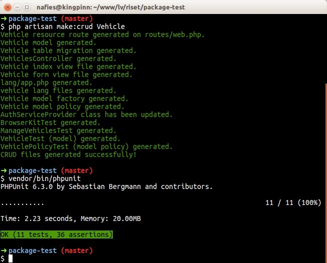

# Laravel Simple CRUD Generator
[](https://travis-ci.org/nafiesl/SimpleCrudGenerator)

An artisan `make:crud` command to create a simple CRUD feature on your Laravel 5.5 application.

> **Development in progress**

## About this package
With this package installed on local environment, we can use (e.g.) `php artisan make:crud Vehicle` command to generate some files :
- `App\Vehicle.php` eloquent model
- `xxx_create_vehicles_table.php` migration file
- `VehiclesController.php`
- `index.blade.php` and `forms.blade.php` view file in `resources/views/vehicles` directory
- `resources/lang/vehicle.php` lang file
- `VehicleFactory.php` model factory file
- `VehiclePolicy.php` model policy file in `app/Policies` directory
- `ManageVehiclesTest.php` feature test class in `tests/Feature` directory
- `VehicleTest.php` unit test class in `tests/Unit/Models` directory
- `VehiclePolicyTest.php` unit test class in `tests/Unit/Policies` directory

It will update some file :
- Update `routes/web.php` to add `vehicles` resource route
- Update `app/providers/AuthServiceProvider.php` to add Vehicle model Policy class in `$policies` property

It will also create this file **if it not exists** :
- `resources/lang/app.php` lang file if it not exists
- `tests/BrowserKitTest.php` base Feature TestCase class if it not exists

The **Model and table** will only have 2 pre-definded attributes or columns : `name` and `description` on each generated model and database table.

## Attention
- You need a `resources/views/layouts/app.blade.php` view file, simply create one with `php artisan make:auth` command.
- Use this package on new Laravel project for simulation.
- It will creates the **Model** class file, ~don't use it to generate files for existing Model~ it cancel the command if the **Model already exists**.
- This package still in development

## How to install
This package has not been submitted to packagist, so we can use github repo as additional repository. To have the additional repository, we do some configiration on `composer.json` file, add this :

```json
    "repositories": [
        {
            "type": "vcs",
            "url": "https://github.com/nafiesl/SimpleCrudGenerator.git"
        }
    ],
```
then

```bash
# Bootstrap Form Field generator
$ composer require luthfi/formfield

# Get the package
$ composer require luthfi/simple-crud-generator dev-master --dev
```

## How to use
The package will **auto-discovered** in **Laravel 5.5**. Just type in terminal:

```bash
$ php artisan
```

We will find the `make:crud` command, it will `Create simple Laravel CRUD files of given model name`.

```bash
$ php artisan make:crud Vehicle

Vehicle resource route generated on routes/web.php.
Vehicle model generated.
Vehicle table migration generated.
VehiclesController generated.
Vehicle index view file generated.
Vehicle form view file generated.
lang/app.php generated.
vehicle lang files generated.
Vehicle model factory generated.
Vehicle model policy generated.
AuthServiceProvider class has been updated.
BrowserKitTest generated.
ManageVehiclesTest generated.
VehicleTest (model) generated.
VehiclePolicyTest (model policy) generated.
CRUD files generated successfully!
```

Create mysql database, set your database credential on `.env` file. Then :

```bash
$ php artisan migrate
$ php artisan serve
```

Visit your application in new resource route : `http://127.0.0.1:8000/vehicles`



### Let's try the generated testing suite

Next, to use the generated testing classes, we can set the database environment using *in-memory* database SQLite. Open `phpunit.xml`. Add two lines below on the `env` :

```xml
<phpunit>
    <!-- ..... -->
    <php>
        <!-- ..... -->
        <env name="DB_CONNECTION" value="sqlite"/>
        <env name="DB_DATABASE" value=":memory:"/>
    </php>
</phpunit>
```

Then run PHPUnit

```bash
$ vendor/bin/phpunit
```

All tests should be passed.



## License

This package is open-sourced software licensed under the [MIT license](LICENSE).
